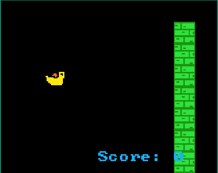

# 🐦 Dan The Bird

**Author**: Yash00241  
**Tags**: `beginner`, `endless`, `duck`, `flappybird`  
**Added On**: August 29, 2024

## 🎮 Game Overview

**Dan The Bird** is a beginner-friendly, endless, Flappy Bird-inspired game made using JerryScript. Guide Dan through a series of walls by moving up and down. The challenge? The walls keep coming, and your reflexes will be put to the test!

  
*Screenshot of Dan The Bird in action.*

Psst !! You Can Also Check Out The Live Preview here : https://sprig.hackclub.com/~/IpKM33QfZbXVnAjbR2ki

## 🚀 How to Play

- **Controls**:
  - Press **W** to move up.
  - Press **S** to move down.
- **Objective**: Avoid the walls and keep flying for as long as possible. Your score increases as you progress!

### Game Features

- **Endless Gameplay**: The game continues as long as you can keep Dan flying without crashing.
- **Dynamic Obstacles**: Walls appear with random openings, making each run unique.
- **Scoring System**: Your score increases with each new wall Dan successfully avoids.
- **Background Music**: Enjoy a custom tune as you play, adding to the immersive experience.

## 🛠️ You Can Play this game on your Sprig Console :)
Get your sprig now !!! 
https://sprig.hackclub.com
